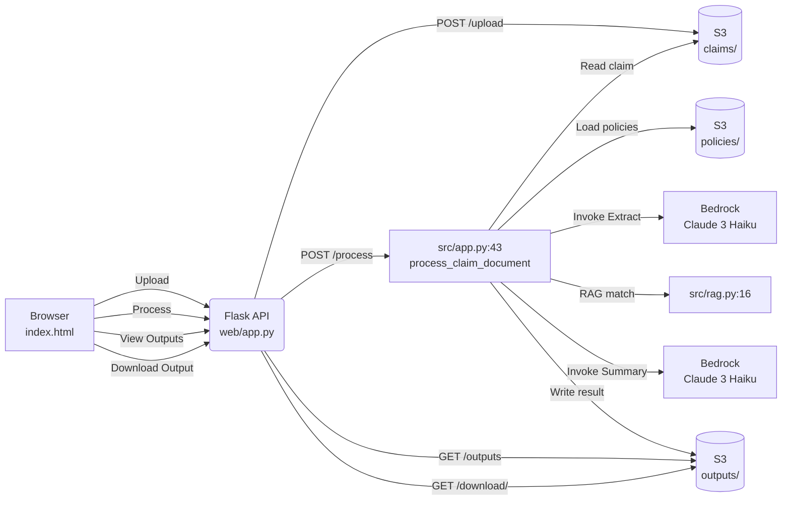

# AWS AIP Bonus Project: Bedrock Insurance Claims Processing System


An intelligent insurance claims processing system built as part of AWS AI Professional (AIP) Bonus Project. This system leverages AWS Bedrock's generative AI capabilities to automate and streamline insurance claims analysis workflow.

## 🚀 Features

- **AI-Powered Document Processing**: Extracts key information from claim documents using Claude 3 Haiku
- **RAG Implementation**: Retrieves relevant policy snippets through keyword matching
- **Automated Summarization**: Generates comprehensive claim summaries with coverage assessments
- **Cloud Integration**: Stores and retrieves documents from AWS S3
- **Robust Error Handling**: Graceful handling of API errors and data validation issues

## 🏗️ Architecture

```
┌─────────────────┐    ┌──────────────────┐    ┌─────────────────┐
│   S3 Storage   │───▶│  Document       │───▶│  AI Processing │
│                 │    │  Processing     │    │  (Bedrock)    │
│ - Claims/       │    │                 │    │                 │
│ - Outputs/      │    │                 │    │                 │
│ - Policies/      │    │                 │    │                 │
└─────────────────┘    └──────────────────┘    └─────────────────┘
```

### Mermaid Diagram



### Core Components

1. **Document Ingestion**
   - Retrieves claim documents from S3
   - Supports multiple document formats
   - Handles file path configuration

2. **Information Extraction**
   - Uses AWS Bedrock Claude 3 Haiku model
   - Extracts structured data (claimant, policy, dates, amounts)
   - Validates extracted information

3. **Policy Retrieval (RAG)**
   - Keyword-based policy matching
   - Configurable retrieval parameters
   - Returns relevant policy snippets

4. **Summary Generation**
   - Creates comprehensive claim summaries
   - Assesses coverage based on policies
   - Recommends processing steps

## 🛠️ Technology Stack

- **Python 3.13+** with virtual environment
- **AWS Bedrock** for generative AI
- **AWS S3** for document storage
- **Boto3** for AWS service integration
- **Messages API** for Claude 3+ models

## 📋 Requirements

- Python 3.10 or higher
- AWS CLI configured with appropriate permissions
- S3 bucket with claim documents
- AWS Bedrock access enabled

## 🚀 Quick Start

1. **Clone the repository**
   ```bash
   git clone https://github.com/yourusername/bedrock-insurance-claims-poc.git
   cd bedrock-insurance-claims-poc
   ```

2. **Set up virtual environment**
   ```bash
   python3 -m venv venv
   source venv/bin/activate
   pip install -r requirements.txt
   ```

3. **Configure settings**
   ```bash
   cp src/config.py.example src/config.py
   # Edit config.py with your settings
   ```

4. **Run the application**
   ```bash
   python -m src.app
   ```

## 📁 Project Structure

```
bedrock-insurance-claims-poc/
├── src/
│   ├── __init__.py
│   ├── app.py              # Main application logic
│   ├── config.py            # Configuration settings
│   ├── models.py            # Bedrock integration
│   ├── prompts.py           # Prompt templates
│   ├── rag.py               # Policy retrieval
│   └── validator.py         # Data validation
├── docs/
│   └── content/            # Documentation content
├── requirements.txt
└── README.md
```

## 🔧 Configuration

Key configuration options in `src/config.py`:

```python
# S3 settings
CLAIM_BUCKET = "your-bucket-name"
CLAIMS_PREFIX = "claims/"
OUTPUTS_PREFIX = "outputs/"
POLICIES_PREFIX = "policies/"

# Bedrock model IDs
DOC_EXTRACT_MODEL_ID = "anthropic.claude-3-haiku-20240307-v1:0"
SUMMARY_MODEL_ID = "anthropic.claude-3-haiku-20240307-v1:0"
```

## 📊 Sample Output

The system processes claims and generates structured JSON output:

```json
{
  "claim_key": "claims/sample_claim1.txt",
  "extracted_info": {
    "claimant_name": "John Doe",
    "policy_number": "ABC123456",
    "incident_date": "2023-04-15",
    "claim_amount": 2500.0,
    "incident_description": "Car accident with vehicle damage..."
  },
  "summary": "Comprehensive claim summary with coverage assessment...",
  "policy_snippets": ["Relevant policy snippets..."],
  "extract_model_id": "anthropic.claude-3-haiku-20240307-v1:0",
  "summary_model_id": "anthropic.claude-3-haiku-20240307-v1:0"
}
```

## 🐛 Troubleshooting

### Common Issues

1. **Import Errors**
   - Ensure all `__init__.py` files exist
   - Check relative imports in `src/app.py`
   - Verify virtual environment activation

2. **AWS Authentication**
   - Configure AWS CLI with `aws configure`
   - Verify IAM permissions for Bedrock and S3
   - Check region settings

3. **Model Access**
   - Enable Bedrock models in AWS console
   - Verify model IDs are correct and active
   - Check API key permissions

## 🔮 Future Enhancements

- [ ] Advanced RAG with vector embeddings
- [ ] Web interface for claim submission
- [ ] Real-time processing status
- [ ] Multi-tenant support
- [ ] Audit logging and compliance features
- [ ] Integration with insurance management systems

## 📄 License

This project is licensed under the MIT License - see the [LICENSE](LICENSE) file for details.

## 🤝 Contributing

1. Fork the repository
2. Create a feature branch
3. Make your changes
4. Add tests if applicable
5. Submit a pull request

## 📞 Support

For questions and support:
- Create an issue in the repository
- Review the documentation
- Check AWS Bedrock documentation

---

## Architecture Overview

This project demonstrates a complete insurance claims processing pipeline:

1. **Document Upload**: Analyst uploads insurance claim documents to S3 bucket
2. **Information Extraction**: Python application retrieves documents and sends to Bedrock for structured data extraction
3. **Policy Retrieval**: Simple RAG implementation retrieves relevant policy snippets from S3
4. **Summary Generation**: Bedrock model generates comprehensive claim summary with coverage assessment
5. **Output Storage**: Structured results saved to S3 as JSON for downstream processing

The system successfully handles:
- Multiple document formats
- Error handling and validation
- Configuration-driven deployment
- Scalable cloud architecture

**Built as part of AWS AI Professional (AIP) Bonus Project**

#AWS #AI #MachineLearning #Insurance #Bedrock #Python #GenerativeAI
